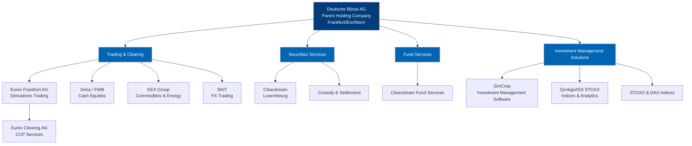

# Chapter 1: Deutsche Börse Exchange Overview

## Introduction

Deutsche Börse AG represents one of the world's leading exchange organizations, operating a comprehensive ecosystem of trading, clearing, settlement, and data services. Understanding the corporate structure, business segments, and technological infrastructure of Deutsche Börse is essential for anyone seeking to engage with high-frequency trading on its platforms. This chapter provides a detailed overview of the organization, its key subsidiaries, trading venues, and the technology that powers global markets.

## Corporate Structure

Deutsche Börse AG serves as the parent holding company, headquartered in Frankfurt/Eschborn, Germany. The organization operates through a network of specialized subsidiaries, each focusing on distinct aspects of capital markets infrastructure.

### Key Subsidiaries and Business Units

**Frankfurter Wertpapierbörse (FWB)**
The Frankfurt Stock Exchange, also known as FWB, represents the operational arm for cash equity trading in Germany. FWB commands approximately 90% of the German equity market share, making it the dominant venue for German stock trading. *(Source: [Xetra Overview](https://www.xetra.com))*

**Eurex Frankfurt AG**
Eurex Frankfurt AG operates as a wholly-owned subsidiary of Deutsche Börse AG. The company represents one of the world's leading derivatives exchanges. Since January 2012, Deutsche Börse has held full ownership of Eurex, having previously operated it as a joint venture with SIX Swiss Exchange. This full acquisition consolidated Deutsche Börse's control over one of Europe's most important derivatives trading platforms. *(Source: [Eurex Exchange](https://www.eurex.com))*

**Eurex Clearing AG**
Eurex Clearing AG functions as a wholly-owned subsidiary of Eurex Frankfurt AG, providing central counterparty (CCP) clearing services. As one of Europe's leading clearing houses, Eurex Clearing manages risk for derivatives and securities transactions across multiple asset classes. *(Source: [Eurex Clearing](https://www.eurex.com/ex-en/find/initiatives/eurex-clearing))*

**Clearstream**
Based in Luxembourg, Clearstream became fully owned by Deutsche Börse in July 2002. Clearstream provides post-trade services including custody, settlement, and asset servicing for both domestic and international securities. The subsidiary plays a critical role in connecting capital markets globally through its settlement infrastructure. *(Source: [Deutsche Börse Group Structure](https://www.deutsche-boerse.com))*

**EEX Group (European Energy Exchange)**
The EEX Group operates commodity and energy markets, providing trading platforms for power, natural gas, environmental products, freight, and agricultural commodities. With over 850 trading participants, EEX has established itself as a central venue for European energy trading. *(Source: [Deutsche Börse Business Areas](https://www.deutsche-boerse.com))*

**360T**
360T operates as Deutsche Börse's global foreign exchange (FX) trading platform, connecting banks, institutional investors, and corporations in the FX spot, forward, swap, and options markets. *(Source: [Deutsche Börse Group](https://www.deutsche-boerse.com))*

**Qontigo and ISS STOXX**
These entities focus on index development, analytics, and ESG (Environmental, Social, and Governance) solutions. The index business includes the well-known STOXX and DAX index families, which serve as benchmarks for European equity markets. *(Source: [Deutsche Börse Investment Management Solutions](https://www.deutsche-boerse.com))*

**SimCorp**
SimCorp provides investment management software solutions, representing Deutsche Börse's presence in the front-to-back office technology space for asset managers and institutional investors. *(Source: [Deutsche Börse Group](https://www.deutsche-boerse.com))*

## Business Segments

Deutsche Börse organizes its operations into four primary business segments, each addressing distinct client needs across the capital markets value chain:

### 1. Investment Management Solutions
This segment encompasses SimCorp's investment management platforms, Axioma's risk analytics, and the ISS STOXX, STOXX, and DAX index families. These products serve asset managers, pension funds, insurance companies, and institutional investors requiring portfolio management, risk assessment, and benchmark indices. *(Source: [Deutsche Börse Business Model](https://www.deutsche-boerse.com))*

### 2. Trading & Clearing
The Trading & Clearing segment represents the core exchange business, operating Eurex derivatives trading, EEX commodity markets, Xetra cash equities, and 360T FX trading. This segment also includes Eurex Clearing's central counterparty services. Together, these platforms facilitate price discovery and risk transfer across multiple asset classes. *(Source: [Deutsche Börse Business Segments](https://www.deutsche-boerse.com))*

### 3. Fund Services
Delivered primarily through Clearstream, Fund Services provides specialized post-trade infrastructure for investment funds, including fund order routing, settlement, custody, and distribution support. *(Source: [Deutsche Börse Fund Services](https://www.deutsche-boerse.com))*

### 4. Securities Services
Also operated through Clearstream, Securities Services offers custody, settlement, and asset servicing for international and domestic securities. This includes securities lending, collateral management, and connectivity to global settlement networks. *(Source: [Deutsche Börse Securities Services](https://www.deutsche-boerse.com))*

## The 7 Market Technology Suite

Deutsche Börse has developed a comprehensive technology platform known as the "7 Suite," representing integrated systems for trading, clearing, and post-trade services:

- **T7**: The flagship trading system powering Eurex derivatives and Xetra cash markets
- **C7**: Clearing technology operated by Eurex Clearing
- **N7**: Network infrastructure providing low-latency connectivity
- **M7**: Alternative trading platform technology
- **F7**: Trading technology for specialized markets
- **A7**: Analytics and data distribution platforms
- **D7**: Digital post-trade services

The T7 trading system has achieved significant market penetration beyond Deutsche Börse's own venues. T7 powers exchanges in Budapest, Ljubljana, Malta, Prague, Sofia, Vienna, and Zagreb, demonstrating its scalability and reliability as an enterprise-grade exchange platform. *(Source: [T7 Trading Architecture](https://www.xetra.com/xetra-en/technology/t7))*

## Trading Venues

Deutsche Börse operates multiple trading venues, each optimized for specific asset classes and trading models.

### Xetra

Xetra, launched on November 28, 1997, replaced the earlier IBIS (Integriertes Börsenhandels- und Informations-System), marking the transition from floor-based trading to a fully electronic trading environment. Xetra provides continuous trading for cash equities, exchange-traded funds (ETFs), bonds, and other securities. *(Source: [Xetra Overview](https://www.xetra.com))*

The platform operates two primary market segments:

**Regulated Market**
- **Prime Standard**: Higher transparency requirements, quarterly reporting, international accounting standards
- **General Standard**: Minimum EU regulatory requirements

**Open Market**
- **Scale**: Segment for small and medium-sized growth companies
- **Basic Board**: Entry-level segment with lower admission requirements

Xetra lists shares from more than 60 countries, providing a truly international equity trading platform. With approximately 90% market share in German equities and approximately 60% market share in DAX components, Xetra represents the primary venue for German equity trading. *(Source: [Xetra Market Structure](https://www.xetra.com))*

**Trading Volume Statistics**
In January 2026, Xetra recorded equity turnover of EUR 121 billion. For the full year 2025, ETF and ETP trading on Xetra reached EUR 352.4 billion, representing a 52.7% year-over-year increase. Xetra holds the position as Europe's largest ETF exchange measured by both turnover and listings. *(Source: [Xetra Market Data](https://www.xetra.com))*

The market capitalization of companies traded on Xetra approximates EUR 2.6 trillion, reflecting the depth and breadth of the German equity market. *(Source: [Xetra Statistics](https://www.xetra.com))*

### Eurex

Eurex operates as one of the world's leading derivatives exchanges, offering futures and options across multiple asset classes:

**Product Classes**
- **Fixed Income Derivatives**: Euro-Bund futures, Euro-Bobl futures, Euro-Schatz futures
- **Equity and Index Derivatives**: STOXX 50 futures and options, DAX futures and options, single stock options
- **Interest Rate Derivatives**: EURIBOR and ESTR-based products
- **Volatility Products**: VSTOXX futures and options
- **Foreign Exchange Derivatives**: Currency futures and options
- **Commodity Derivatives**: Select commodity-linked products

Eurex provides deep liquidity across European benchmark products, particularly in fixed income futures where Euro-Bund futures represent a global standard for European government bond exposure. *(Source: [Eurex Product Range](https://www.eurex.com))*

### EEX (European Energy Exchange)

The EEX Group specializes in commodity and energy derivatives:

- **Power Markets**: European electricity futures and spot markets
- **Natural Gas**: Gas futures and options across European hubs
- **Environmental Products**: Emission allowances (EUA), certificates
- **Freight**: Dry freight derivatives
- **Agricultural Commodities**: Grains, oilseeds, and related products

With over 850 trading participants, EEX serves as a central price discovery venue for European energy markets. *(Source: [EEX Overview](https://www.eex.com))*

## Historical Context

Understanding the historical evolution of Deutsche Börse's trading infrastructure provides important context for its current technological architecture.

### Xetra Launch and IBIS Transition

Xetra's launch on November 28, 1997, marked a pivotal transformation in German equity trading. The system replaced IBIS, which had served as an electronic order book system since the late 1980s. The transition to Xetra represented a complete shift from floor-based trading to a fully electronic, screen-based continuous auction model. This transformation enabled higher trading speeds, greater transparency, and the foundation for algorithmic and high-frequency trading strategies. *(Source: [Xetra History](https://www.xetra.com))*

### Eurex Ownership Evolution

Eurex began as a joint venture between Deutsche Börse and SIX Swiss Exchange, combining the derivatives trading activities of both the Frankfurt and Swiss exchanges. In January 2012, Deutsche Börse acquired full ownership of Eurex, consolidating control over the derivatives platform and aligning it fully with Deutsche Börse's strategic direction. *(Source: [Eurex Exchange](https://www.eurex.com))*

### Clearstream Acquisition

The full acquisition of Clearstream in July 2002 represented a strategic vertical integration, bringing post-trade settlement and custody services under Deutsche Börse's control. This integration created a seamless value chain from trade execution through clearing and settlement. *(Source: [Deutsche Börse Corporate History](https://www.deutsche-boerse.com))*

## Organizational Structure

The following diagram illustrates Deutsche Börse's organizational structure, showing the relationship between the parent holding company and its major subsidiaries:

## Regulatory Framework

As a regulated exchange organization, Deutsche Börse operates under the supervision of German and European financial regulators. The Frankfurt Stock Exchange (FWB) holds authorization as a regulated market under EU MiFID II regulations. Eurex operates as a regulated derivatives exchange, subject to EMIR (European Market Infrastructure Regulation) requirements. Eurex Clearing functions as an authorized central counterparty under EMIR.

These regulatory frameworks establish requirements for market transparency, trade reporting, pre-trade and post-trade transparency, best execution, and risk management. High-frequency trading participants must comply with additional requirements including algorithmic trading notifications, system testing, risk controls, and order-to-trade ratio monitoring.

## Technology and Market Access

Deutsche Börse provides multiple connectivity options for market participants:

**T7 Enhanced Trading Interface (ETI)**
The native T7 protocol provides high-performance order entry and market data access for professional traders and high-frequency trading firms. ETI offers low-latency connectivity with microsecond-level precision. *(Source: [T7 Technology](https://www.xetra.com/xetra-en/technology/t7))*

**FIX Protocol Support**
For participants preferring industry-standard connectivity, Deutsche Börse supports FIX (Financial Information eXchange) protocol connectivity to both Xetra and Eurex.

**Proximity Hosting**
Deutsche Börse offers co-location services, enabling trading firms to place their servers in close physical proximity to the exchange matching engines, minimizing network latency.

**Network Infrastructure (N7)**
The N7 network provides dedicated, low-latency connectivity between trading participants and the exchange infrastructure, optimized for high-frequency trading requirements.

## Conclusion

Deutsche Börse represents a comprehensive capital markets infrastructure provider, combining trading venues, clearing services, settlement systems, and data products into an integrated ecosystem. The organization's evolution from floor-based trading to fully electronic markets, exemplified by Xetra's launch in 1997 and the continuous development of the T7 platform, has positioned it as a technology leader in European exchanges.

For high-frequency trading participants, understanding Deutsche Börse's corporate structure, business segments, and trading venues provides essential context for navigating connectivity options, regulatory requirements, and market microstructure. The following chapters will explore the technical architecture of the T7 trading system, market data protocols, order types, and strategies specific to Deutsche Börse's trading environments.

---

[Next: Chapter 2 - T7 Trading System Architecture >>](../02-t7-architecture/README.md)
