# ETI Session Lifecycle

This diagram illustrates the complete lifecycle of an ETI (Enhanced Trading Interface) session on Deutsche Boerse's T7 trading system, from connection establishment through order flow to session termination and recovery.

```mermaid
sequenceDiagram
    participant App as Trading Application
    participant GW as PS/LF Gateway
    participant ME as Matching Engine

    rect rgb(200, 220, 240)
        Note over App,GW: Phase 1: Connection Establishment
        App->>GW: TCP/IP Connection Request
        GW->>App: TCP/IP Connection Accepted
        App->>GW: TLS 1.3 Handshake
        GW->>App: TLS 1.3 Established
    end

    rect rgb(220, 240, 220)
        Note over App,GW: Phase 2: Session Login
        App->>GW: Session Logon Request<br/>(SessionID, Credentials, AppDetails)
        GW->>App: Session Logon Response<br/>(Throttle: 50/150/250 TPS)
    end

    rect rgb(240, 240, 200)
        Note over App,GW: Phase 3: Heartbeat Exchange
        loop Periodic Interval
            App->>GW: Heartbeat
            GW->>App: Heartbeat Notification
        end
    end

    rect rgb(200, 240, 200)
        Note over App,ME: Phase 4: Order Submission
        App->>GW: NewOrderSingle<br/>(OrderID, Instrument, Price, Qty)
        activate GW
        GW->>ME: Forward Order
        activate ME
        ME->>GW: ExecutionReport<br/>(ExecType=New, OrdStatus=New)
        deactivate ME
        GW->>App: ExecutionReport (Acknowledged)
        deactivate GW
        Note over App,GW: Median latency: less than 55 us via PS Gateway
    end

    rect rgb(220, 200, 240)
        Note over App,ME: Phase 5: Order Fill
        Note right of ME: Matching order arrives
        activate ME
        ME->>GW: ExecutionReport<br/>(ExecType=Fill, OrdStatus=Filled)
        deactivate ME
        activate GW
        GW->>App: ExecutionReport (Fill Notification)
        deactivate GW
        Note over GW,App: EOBI market data published<br/>~1.5 us BEFORE this ETI response
    end

    rect rgb(240, 220, 200)
        Note over App,ME: Phase 6: Order Modification
        App->>GW: ModifyOrder (NewPrice/NewQty)
        activate GW
        GW->>ME: Forward Modification
        activate ME
        ME->>GW: ExecutionReport (ExecType=Replaced)
        deactivate ME
        GW->>App: ExecutionReport (Modified)
        deactivate GW
    end

    rect rgb(240, 200, 200)
        Note over App,ME: Phase 7: Order Cancellation
        App->>GW: DeleteOrder (OrderID)
        activate GW
        GW->>ME: Forward Deletion
        activate ME
        ME->>GW: ExecutionReport (ExecType=Canceled)
        deactivate ME
        GW->>App: ExecutionReport (Canceled)
        deactivate GW
    end

    rect rgb(255, 220, 220)
        Note over App,GW: Phase 8: Error Handling
        alt Invalid Request
            App->>GW: Invalid Message
            GW->>App: BusinessMessageReject (ErrorCode)
        else Throttle Violation
            App->>GW: Order (exceeds TPS limit)
            GW->>App: Reject (ThrottleError)
        end
    end

    rect rgb(200, 200, 200)
        Note over App,GW: Phase 9: Session Logout
        App->>GW: Logout Request
        GW->>App: Logout Response
        Note over App,GW: TCP connection closed
    end

    rect rgb(220, 220, 240)
        Note over App,GW: Phase 10: Recovery (Disconnect)
        alt Connection Lost
            Note over App,GW: Network failure detected
            App->>GW: Reconnect TCP + TLS
            App->>GW: Session Logon (Recovery)
            GW->>App: Session Logon Response
            App->>GW: Retransmission Request
            GW->>App: Missed ExecutionReports
        end
    end
```

## Diagram Description

### ETI Session Lifecycle Overview

This sequence diagram illustrates the complete lifecycle of an Enhanced Trading Interface (ETI) session on Deutsche Boerse's T7 trading platform. The diagram covers ten phases from initial connection establishment through normal trading operations to session termination and error recovery.

### Phase 1: Connection Establishment

The session begins with a TCP/IP connection to the Application Gateway, followed by a mandatory TLS 1.3 handshake. Since T7 Release 14.1 (May 2026), TLS 1.3 is the only supported encryption protocol, with TLS 1.2 fully decommissioned. The TLS handshake adds single-digit microseconds of latency to the initial connection but secures all subsequent message exchanges.

### Phase 2: Session Login

After establishing the secure channel, the trading application sends a Session Logon Request containing:

- **SessionID**: Unique identifier assigned by Deutsche Boerse (one active session per SessionID at any time)
- **Credentials**: Username and password encrypted using public key encryption
- **Application Details**: Version information and application identification

The gateway responds with throttle limits based on the session type:
- HF Light: 50 transactions per second (TPS)
- HF Full: 150 TPS
- HF Ultra: 250 TPS (available since June 2023)
- Disaster Recovery: 30 TPS

### Phase 3: Heartbeat Exchange

Periodic heartbeat messages maintain connection liveness. If the gateway does not receive heartbeats within the configured interval, the session is terminated. In cases of stalled TCP connections, no ETI heartbeat messages are received from the gateway but the underlying TCP connection may remain open, requiring application-level timeout detection.

### Phase 4: Order Submission

The NewOrderSingle message carries order details including instrument identifier, price, quantity, and order type. The message flows through the gateway to the matching engine, which responds with an ExecutionReport confirming order acceptance (ExecType=New, OrdStatus=New).

**Timing**: The median latency from order submission to acknowledgment measures less than 55 microseconds via Partition-Specific (PS) gateways. Low-Frequency (LF) gateway routing adds approximately 12 microseconds. ETI always sends exactly one response message per request.

### Phase 5: Order Fill

When a matching order arrives and execution occurs, the matching engine generates an ExecutionReport with ExecType=Fill or PartialFill. A critical architectural characteristic: **EOBI market data reflecting the trade is published approximately 1.5 microseconds BEFORE the ETI execution report reaches the order originator**. This "public data first" principle ensures that all market participants observe price changes before the trading party receives private confirmation.

### Phase 6: Order Modification

ModifyOrder requests allow price and quantity changes to existing orders. The matching engine processes modifications atomically, responding with ExecType=Replaced. Queue priority rules apply: modifications that improve price maintain priority, while other modifications may result in loss of time priority.

### Phase 7: Order Cancellation

DeleteOrder messages cancel individual orders. For bulk operations, MassDeleteOrder cancels all orders matching specified criteria (per product, per partition, or per session). The matching engine confirms each cancellation with ExecType=Canceled.

### Phase 8: Error Handling

Two error scenarios are illustrated:

- **Invalid Request**: Malformed or logically invalid messages receive a BusinessMessageReject with a specific error code for programmatic handling.
- **Throttle Violation**: When a participant exceeds their session's TPS limit, subsequent orders are rejected with a ThrottleError until the message rate drops below the threshold.

### Phase 9: Session Logout

Graceful session termination follows a Logout Request/Response exchange followed by TCP connection closure. Open orders remain active in the order book unless explicitly canceled before logout. Participants should cancel time-sensitive orders before disconnecting.

### Phase 10: Recovery (Disconnect Scenario)

If the connection is lost unexpectedly, recovery procedures differ by session type:

- **HF Sessions**: Attempt reconnection to the same PS Gateway/Matching Engine first. If unavailable, connect to the backup PS Gateway (standby started only during actual failover, with immediate login available and no grace period).
- **LF Sessions**: Reconnect to a different LF Gateway and request retransmission of missed execution notifications and order data.

The retransmission mechanism ensures that participants can recover complete order state after network interruptions.

### Key Timing Characteristics

| Metric | Value |
|--------|-------|
| Order-to-Acknowledgment (PS Gateway) | < 55 microseconds median |
| LF Gateway Additional Latency | ~12 microseconds |
| EOBI Publication Lead | ~1.5 microseconds before ETI response |
| TLS 1.3 Overhead | Single-digit microseconds per roundtrip |
| Maximum Sessions per Participant | 600 (since June 2024) |

---

[Back to Chapter 4: Trading Interfaces](../chapters/04-trading-interfaces/README.md)
