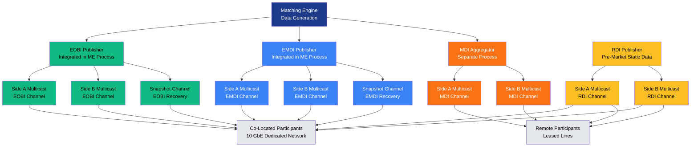

# Market Data Distribution

Deutsche Boerse's T7 system distributes market data through four specialized feeds, each optimized for different use cases. The architecture employs live-live redundancy across Side A and Side B multicast networks, with EOBI and EMDI publishers integrated directly into the matching engine process for minimal latency. This design ensures that public market data reaches all participants simultaneously, adhering to the "public data first" principle while offering differentiated service tiers based on depth, protocol, and latency requirements.

## Diagram Description

### Data Generation at the Matching Engine

All market data originates from the matching engine, which generates order book updates, trade executions, auction results, and instrument status changes. Since Release 12.0, EOBI and EMDI publishers are integrated directly into the matching engine process rather than running as separate applications. This integration eliminates inter-process communication overhead and reduces latency by approximately 4 microseconds for EOBI.

### Feed Types and Characteristics

**EOBI (Enhanced Order Book Interface)** provides full depth-of-book data in a proprietary binary format. It is the fastest feed, with typical latency of 20-30 microseconds from matching engine to network interface. EOBI is designed for high-frequency trading firms requiring complete market visibility and minimal latency.

**EMDI (Enhanced Market Data Interface)** delivers up to 10-15 price levels in FIX/FAST protocol, offering a balance between depth and simplicity. It includes both incremental updates and periodic snapshots for recovery. EMDI is also integrated into the matching engine process, providing low latency while using industry-standard protocols.

**MDI (Market Data Interface)** aggregates top-of-book data and is processed separately from the matching engine. It provides best bid/offer information with higher latency (typically 100-200 microseconds) but requires less bandwidth and processing power. MDI is suitable for remote participants who do not require full depth or ultra-low latency.

**RDI (Reference Data Interface)** publishes static instrument data during pre-market hours, including trading rules, tick sizes, contract specifications, and calendar information. This feed operates independently of the matching engine and helps participants prepare their systems before market open.

### Redundancy Architecture

Deutsche Boerse implements live-live redundancy through Side A and Side B multicast networks. Each feed type is published simultaneously on both sides using different multicast addresses. Participants receive both streams and can switch between them seamlessly. This design eliminates single points of failure and ensures continuous data availability even during network maintenance or failures.

Side A and Side B operate on separate physical network infrastructure within the data center. Each side has independent switches, routers, and network interfaces on the matching engine servers. Participants typically consume both feeds and use the faster-arriving packet, automatically discarding duplicates based on sequence numbers.

### Network Infrastructure

Co-located participants connect via dedicated 10 Gigabit Ethernet market data networks. These networks are physically separated from order entry networks to prevent congestion from affecting data distribution. Multicast is used exclusively, with each instrument mapped to specific multicast groups to allow selective subscription.

Remote participants receive feeds over leased lines with quality-of-service guarantees. They typically subscribe to MDI rather than EOBI/EMDI due to bandwidth constraints and latency insensitivity. The exchange provides leased line options ranging from 10 Mbps to 1 Gbps depending on participant requirements.

### Recovery Mechanisms

EOBI and EMDI provide snapshot channels that periodically publish full order book images. These snapshots allow participants to recover from packet loss without reconnecting or falling back to slower recovery methods. Snapshot frequency is configurable per instrument class, typically ranging from 1 to 10 seconds.

When a gap is detected in the incremental feed sequence, participants can request the latest snapshot and then resume consuming incremental updates. This recovery mechanism is faster than replaying missed packets from a historical data service and does not require interaction with the exchange's support systems.

### Latency Hierarchy

The latency hierarchy reflects the architectural differences between feeds:

1. **EOBI** (20-30 us) - Integrated in matching engine, binary protocol, minimal processing
2. **EMDI** (30-40 us) - Integrated in matching engine, FIX/FAST encoding overhead
3. **MDI** (100-200 us) - Separate aggregation process, additional network hops

These latencies are measured from the point where the matching engine completes an order match to the time when the first packet arrives at the participant's network interface. Actual end-to-end latency includes participant processing time, which varies by implementation.

### Public Data First Principle

All market data feeds receive identical information simultaneously. There is no privileged early access to market data for any participant category. This "public data first" policy ensures fair access and complies with regulatory requirements under MiFID II. The exchange monitors feed latencies continuously to detect and investigate any anomalies that might indicate unfair advantages.

### Pricing Summary

| Feed | Protocol | Depth | Latency | Target Users | Monthly Fee Range |
|------|----------|-------|---------|--------------|-------------------|
| EOBI | Binary | Full | Lowest (20-30 us) | HFT firms, market makers | EUR 5,000-25,000 |
| EMDI | FIX/FAST | 10-15 levels | Low (30-40 us) | Algorithmic traders, brokers | EUR 3,000-15,000 |
| MDI | FIX/FAST | Top-of-book | Medium (100-200 us) | Retail brokers, data vendors | EUR 1,000-5,000 |
| RDI | FIX/FAST | Static data | Pre-market | All participants | Included with other feeds |

Pricing varies by asset class, with equity derivatives typically priced lower than fixed income or commodity derivatives. Volume discounts and package deals are available for multi-asset subscriptions.

---

[Back to Chapter 5: Market Data Feeds](../chapters/05-market-data/README.md)
