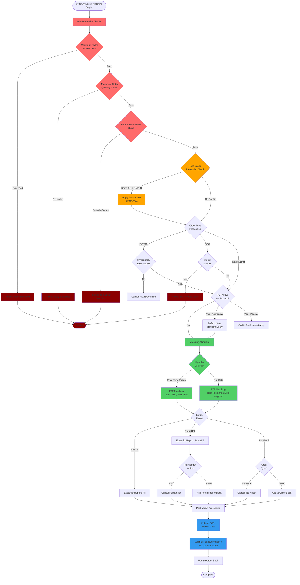

# Matching Engine Flow

## Diagram Description

This flowchart illustrates the complete order processing flow through the Deutsche Boerse T7 matching engine, from arrival to final execution or rejection.

### Pre-Trade Risk Checks (Red)

All incoming orders undergo three critical risk validations before entering the matching engine:

1. **Maximum Order Value (MOV)**: Validates that the notional value (price × quantity) does not exceed configured limits. Typical limit: EUR 10 million per order.

2. **Maximum Order Quantity (MOQ)**: Ensures the order size does not exceed per-instrument quantity limits. Prevents fat-finger errors and market disruption.

3. **Price Reasonability (Collars)**: Checks that the limit price falls within static and dynamic price collars around the current market price. Static collars are typically ±10-20% from reference price; dynamic collars adjust based on volatility.

Orders failing any check are immediately rejected with specific error codes.

### Self-Match Prevention (Orange)

The SMP check prevents a participant from matching against their own orders when both sides share the same business unit identifier and SMP ID. Three cancellation modes:

- **CP (Cancel Passive)**: Cancels the resting order in the book
- **CAP (Cancel Aggressive)**: Cancels the incoming aggressive order
- **CA (Cancel All)**: Cancels both orders

This typically executes in <100 nanoseconds.

### Order Type Processing

Different order types receive specialized handling:

- **IOC (Immediate-or-Cancel)**: Checked for immediate executability; unmatched portions are cancelled rather than resting in the book
- **FOK (Fill-or-Kill)**: Must execute completely or be rejected entirely
- **BOC (Book-or-Cancel)**: Inverse of IOC; rejected if it would match, accepted only if it adds liquidity

### PLP (Passive Liquidity Protection)

When enabled on a product, PLP applies a random delay of 1-3 milliseconds to aggressive orders (those that would cross the spread). Passive orders adding liquidity bypass this delay and enter the book immediately. This mechanism:

- Reduces latency arbitrage opportunities
- Protects displayed liquidity from fast-moving predatory strategies
- Maintains fairness for participants with higher latency

### Matching Algorithm Selection (Green)

T7 supports two primary matching algorithms, configured per product:

1. **Price-Time Priority (PTP)**: Standard FIFO matching at each price level. Used for most equity and index futures products. Orders at the best price are matched in strict time sequence.

2. **Pro-Rata (PTR)**: Size-weighted allocation at each price level, with optional minimum allocation and FIFO remainder distribution. Common in interest rate futures and some commodity markets.

The matching engine executes this logic in approximately 15-25 microseconds from order arrival to match determination.

### Matching Outcomes

Three possible results from the matching algorithm:

- **Full Fill**: Entire order quantity matched; ExecutionReport with fill status sent
- **Partial Fill**: Portion matched; ExecutionReport sent with partial fill status; remainder either added to book (limit orders) or cancelled (IOC orders)
- **No Match**: No executable contra-side available; order added to book or cancelled based on order type

### Post-Match Processing (Blue)

After matching completes, the exchange follows a strict sequencing protocol:

1. **EOBI Publication**: Market data is published via Enhanced Order Book Interface (EOBI) to all market data consumers. This ensures public data dissemination occurs first, maintaining regulatory fairness.

2. **ETI ExecutionReport**: Approximately 1.5 microseconds after EOBI publication, the participant receives their private ExecutionReport via the Enhanced Trading Interface (ETI). This small delay ensures no participant receives execution confirmation before public market data is available.

3. **Order Book Update**: The central order book is updated with new orders, cancellations, and fills. This triggers subsequent EOBI snapshots and incremental updates.

### Timing Characteristics

- Pre-trade risk checks: <100 nanoseconds
- SMP processing: <100 nanoseconds
- PLP deferral: 1-3 milliseconds (when active, for aggressive orders)
- Matching algorithm: 15-25 microseconds
- EOBI to ETI delay: ~1.5 microseconds
- Total latency (arrival to execution): Typically 30-50 microseconds (excluding PLP)

### Rejection Paths (Dark Red)

Orders can be rejected at multiple points:

- Pre-trade risk violations (MOV, MOQ, price collars)
- BOC orders that would match
- IOC/FOK orders with no executable contra-side

Each rejection includes a specific reason code in the ExecutionReport, allowing participants to diagnose and correct submission issues.

---

[Back to Chapter 6: Order Types & Matching](../chapters/06-order-types-matching/README.md)
