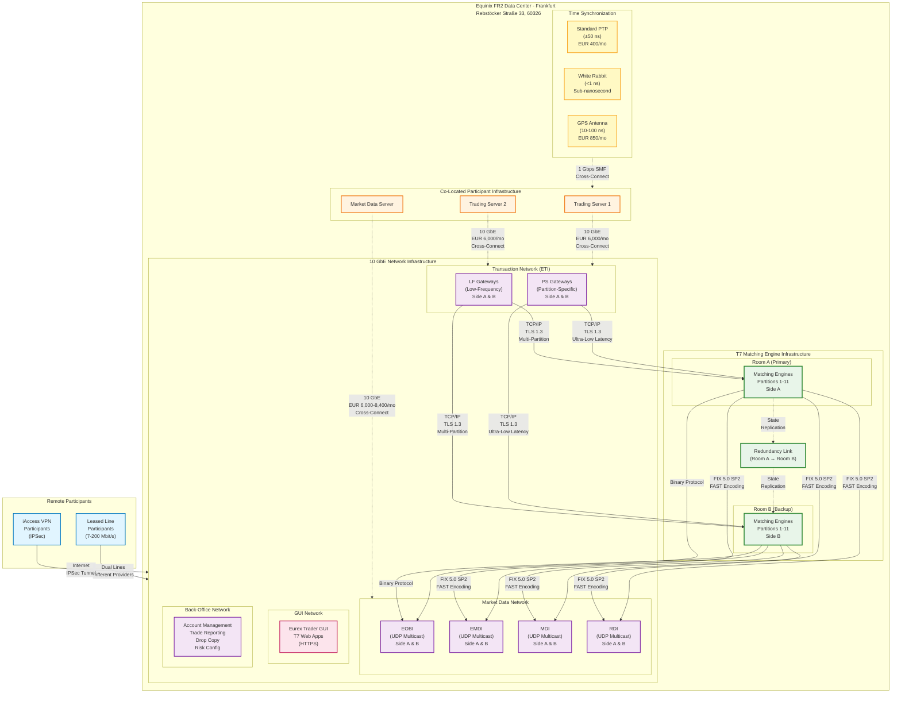

# Network Topology Diagram

This diagram illustrates Deutsche Börse's network topology for the T7 trading system, showing the co-location facility at Equinix FR2, connectivity options, network segments, and redundancy architecture.

## Diagram Description

### Network Topology Overview

This topology diagram illustrates the complete network architecture for Deutsche Börse's T7 trading system, hosted at the Equinix FR2 data center in Frankfurt, Germany. The architecture is designed to provide ultra-low latency connectivity for high-frequency trading while maintaining comprehensive redundancy and fault tolerance.

### Key Components

**1. Remote Participants**
- **Leased Line Participants**: Connect via dedicated point-to-point links with bandwidth options of 7 Mbit/s (standard), 80 Mbit/s, or 200 Mbit/s (enhanced). Dual lines from different providers ensure high availability.
- **iAccess VPN Participants**: Connect via Internet-based IPSec VPN tunnels, suitable for testing, simulation access, and non-latency-sensitive use cases.

**2. Co-Located Infrastructure (Equinix FR2)**
- **Trading Servers**: Participant-owned servers running trading algorithms, connected via 10 Gigabit Ethernet to the Transaction Network.
- **Market Data Servers**: Specialized servers for processing EOBI, EMDI, MDI, and RDI market data feeds.
- **Cross-Connects**: Physical fiber connections (EUR 150/month each) linking participant equipment to Deutsche Börse network infrastructure.

**3. Network Segments**

The T7 network is segregated into distinct segments, each optimized for specific functions:

- **Transaction Network (ETI)**: Handles order submission, modification, cancellation, and execution reporting via TCP/IP with TLS 1.3 encryption. Includes:
  - **PS Gateways**: Partition-Specific gateways providing ultra-low latency access to individual partitions (one gateway per partition).
  - **LF Gateways**: Low-Frequency gateways offering multi-partition access through a single session.

- **Market Data Network**: Distributes market data via UDP multicast with live-live A/B redundancy:
  - **EOBI (Enhanced Order Book Interface)**: Native binary protocol, lowest latency feed, EUR 7,200/month (Xetra).
  - **EMDI (Enhanced Market Data Interface)**: FIX 5.0 SP2 with FAST encoding, Xetra-specific, EUR 6,000/month.
  - **MDI (Market Data Interface)**: Standard feed for top-of-book and trades.
  - **RDI (Reference Data Interface)**: Instrument metadata and configuration data.

- **GUI Network**: Web-based interfaces (Eurex Trader GUI, T7 Web Apps) via HTTPS for manual trading and administration.

- **Back-Office Network**: Administrative functions including account management, trade reporting, drop copy services, and risk configuration.

**4. Time Synchronization**

Three time synchronization options provide participants with varying levels of precision:

- **Standard PTP (IEEE 1588)**: ±50 nanoseconds accuracy, EUR 400/month, suitable for most algorithmic trading and regulatory timestamping requirements.
- **White Rabbit Protocol**: Sub-nanosecond (<1 ns) accuracy with picosecond precision, developed at CERN, for ultra-high-frequency applications.
- **GPS Antenna**: 10-100 nanoseconds accuracy, EUR 850/month for roof space, provides independent time source for validation or redundancy.

**5. T7 Matching Engine Infrastructure**

The matching engines are deployed across two geographically separated rooms for maximum availability:

- **Room A (Primary)**: Hosts active matching engines for all 11 partitions, Side A.
- **Room B (Backup)**: Hosts synchronized backup matching engines for all 11 partitions, Side B.
- **Redundancy Link**: High-speed connection between Room A and Room B enabling state replication and failover coordination.

### Redundancy and Fault Tolerance

The topology implements multiple layers of redundancy:

1. **Side A and Side B**: Each network segment and matching engine operates with dual sides on independent physical infrastructure.
2. **Room A and Room B**: Geographic separation ensures that localized failures do not cause complete outages.
3. **Live-Live Market Data**: Both Side A and Side B market data streams transmit identical data simultaneously via different multicast addresses.
4. **Dual Leased Lines**: Remote participants can order leased lines from different providers for failover capability.
5. **No Single Point of Failure**: Physical network paths, power distribution, and cooling systems are fully redundant.

### Latency Optimization

The co-located infrastructure at Equinix FR2 provides the lowest possible latency:

- **10 GbE Connectivity**: High-bandwidth, low-latency network links.
- **Minimal Hop Count**: Direct connections from participant servers to T7 gateways reduce network traversal time.
- **PS Gateway Consolidation**: Partition-Specific gateways are co-located with matching engines on the same physical server (implemented H1 2021), eliminating inter-server network hops.
- **Deterministic Network**: CoLo 2.0 infrastructure ensures equal network latency for all co-located participants, creating a fair competitive environment.

### Pricing Summary

**Co-Location Connectivity (Monthly Fees)**
- Xetra EMDI: EUR 6,000
- Xetra EOBI: EUR 7,200
- Xetra EMDI + EOBI: EUR 8,400
- Xetra ETI (Transactions): EUR 6,000

**Rack Space (Monthly Fees)**
- 3 kVA: EUR 2,330
- 4 kVA: EUR 2,870
- 5 kVA: EUR 3,390
- 6 kVA: EUR 3,910

**Additional Services (Monthly Fees)**
- Cross-Connect: EUR 150 each
- Standard PTP: EUR 400
- GPS Antenna: EUR 850

This topology supports diverse participant types, from ultra-high-frequency market makers requiring sub-microsecond latency to buy-side algorithmic traders connecting via leased lines or VPN, while maintaining the redundancy and reliability essential for critical trading infrastructure.
