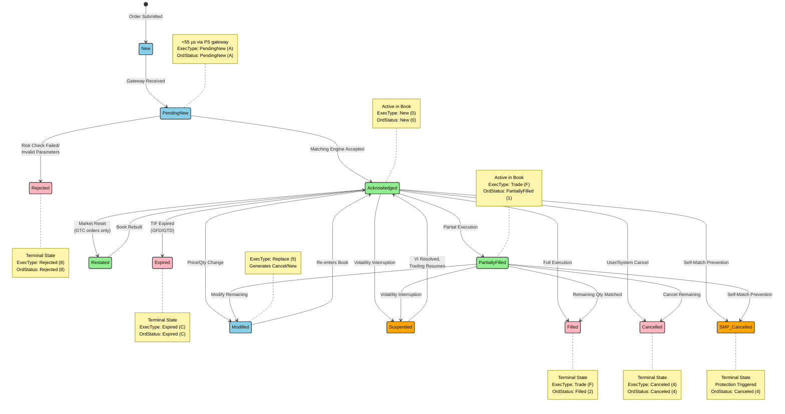
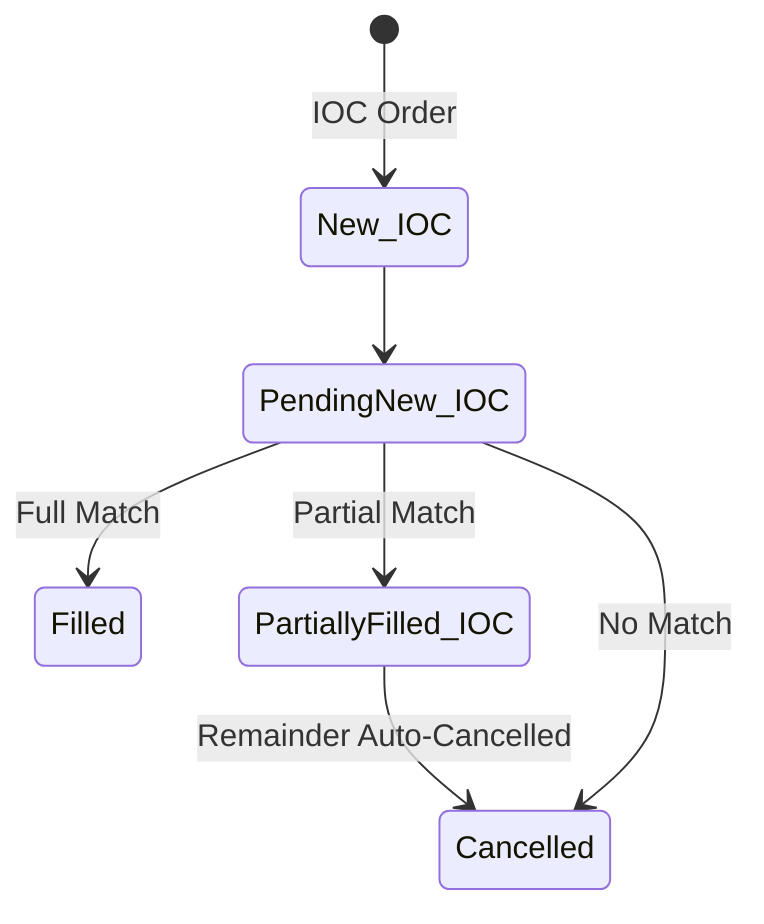
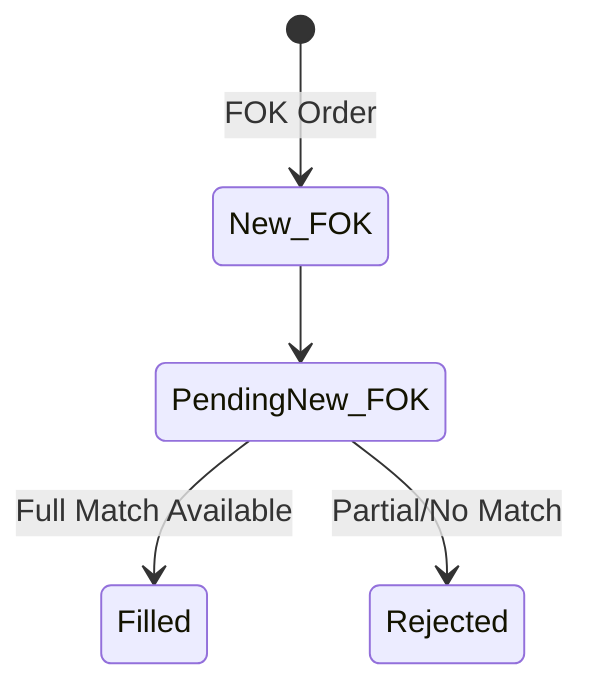
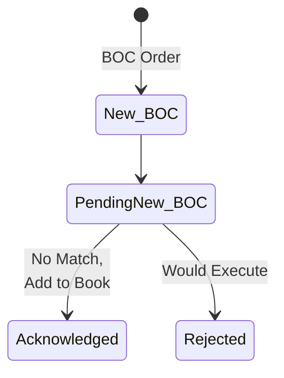
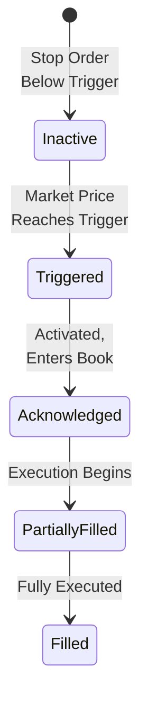

# Order Lifecycle Flow

## Special Order Type Paths

### IOC (Immediate-or-Cancel)

### FOK (Fill-or-Kill)

### BOC (Book-or-Cancel)

### Stop Orders

## Diagram Description

This state diagram illustrates the complete lifecycle of orders in the Deutsche Boerse T7 trading system, showing all possible state transitions and their triggers.

### Order States and ExecType Mapping

Each state transition generates an ETI ExecutionReport with specific ExecType and OrdStatus values:

**Active States (Green)**
- **Acknowledged**: Order is live in the book. ExecType=New (0), OrdStatus=New (0)
- **PartiallyFilled**: Order partially executed, remainder active. ExecType=Trade (F), OrdStatus=PartiallyFilled (1)
- **Restated**: GTC order rebuilt after Market Reset. ExecType=Restated (D), OrdStatus=New (0)

**Intermediate States (Blue)**
- **New**: Order submitted by client, not yet at gateway
- **PendingNew**: Gateway received, awaiting matching engine. ExecType=PendingNew (A), OrdStatus=PendingNew (A)
- **Modified**: Order modification in progress. ExecType=Replace (5), generates Cancel/New pair

**Terminal States (Red)**
- **Filled**: Order fully executed. ExecType=Trade (F), OrdStatus=Filled (2)
- **Cancelled**: Order cancelled by user or system. ExecType=Canceled (4), OrdStatus=Canceled (4)
- **Expired**: Time-in-force expired (GFD at market close, GTD at specified date). ExecType=Expired (C), OrdStatus=Expired (C)
- **Rejected**: Order rejected due to risk check failure or invalid parameters. ExecType=Rejected (8), OrdStatus=Rejected (8)

**Protection States (Orange)**
- **SMP_Cancelled**: Self-match prevention triggered, order cancelled. OrdStatus=Canceled (4)
- **Suspended**: Order suspended during volatility interruption, resumes when VI resolves

### Timing and Performance

- **PendingNew → Acknowledged**: Less than 55 microseconds via Performance Segment gateway
- **Execution**: Trade execution and confirmation typically within 100-200 microseconds
- **Modification**: Cancel/Replace processed as atomic operation, approximately 100 microseconds

### Time-in-Force Handling

**GFD (Good-for-Day)**
- Acknowledged → Expired at end of trading day (17:30 CET for Xetra)
- Does not persist through Market Reset
- Automatically cancelled during closing auction

**GTD (Good-till-Date)**
- Acknowledged → Expired at specified date/time
- Survives Market Reset if expiry date not reached
- Converted to GFD behavior on final day

**GTC (Good-till-Cancel)**
- Survives Market Reset via Restated state
- Acknowledged → Restated → Acknowledged (book rebuild)
- Remains active until explicitly cancelled or filled

**IOC (Immediate-or-Cancel)**
- Special path: PendingNew → (Fill/PartialFill + Auto-Cancel remainder)
- Never enters Acknowledged state
- Unmatched quantity immediately cancelled

**FOK (Fill-or-Kill)**
- All-or-nothing execution
- PendingNew → Filled (if full quantity available) or Rejected (otherwise)
- No partial fills allowed

### Special Order Types

**BOC (Book-or-Cancel)**
- Passive-only orders
- PendingNew → Acknowledged (if no match) or Rejected (if would execute)
- Used to add liquidity without taking liquidity

**Stop Orders**
- Inactive → Triggered (when market price reaches stop price)
- Triggered → Acknowledged (activated stop becomes regular order)
- Then follows normal order lifecycle
- Stop price monitored continuously during trading

### Market Events

**Volatility Interruption (VI)**
- Any active state → Suspended when VI triggered
- Suspended → Acknowledged when VI resolves and trading resumes
- Orders retain price/time priority
- Typical VI duration: 2-5 minutes

**Self-Match Prevention (SMP)**
- Activated when buy and sell orders from same member would match
- Any active state → SMP_Cancelled
- Configurable: cancel incoming, cancel resting, or cancel both
- Prevents wash trades and unintended position changes

**Market Reset**
- Non-persistent orders (GFD, IOC, FOK, BOC) → Cancelled
- Persistent orders (GTC) → Restated → Acknowledged
- Occurs during system maintenance or recovery
- Book rebuilt from persistent orders only

### Modification Behavior

Order modifications (price or quantity changes) are processed as:
1. Cancel existing order (generates Cancel ExecutionReport)
2. Submit new order with updated parameters (generates New ExecutionReport)
3. New order receives new timestamp, loses time priority
4. Atomic operation from client perspective
5. If new order rejected, original order remains cancelled

---

[Back to Chapter 6: Order Types & Matching](../chapters/06-order-types-matching/README.md)
