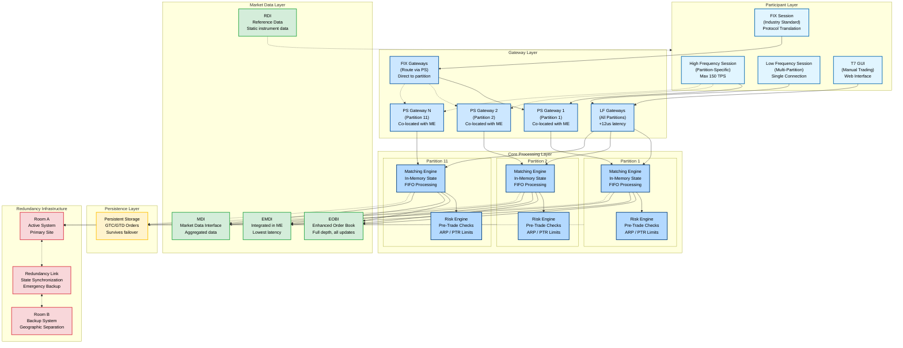

# T7 Architecture Overview

The following diagram illustrates the T7 trading system architecture, showing the participant layer, gateway layer, core processing components, market data distribution, and persistence infrastructure.

## Architecture Layers

### Participant Layer
- **High Frequency Sessions**: Partition-specific, ultra-low latency access via PS gateways. Maximum 150 TPS (Full) or 50 TPS (Light).
- **Low Frequency Sessions**: Single session accessing all partitions, approximately 12 microseconds additional latency.
- **FIX Sessions**: Industry-standard FIX protocol, routed directly to partitions via PS gateways.
- **T7 GUI**: Web-based interface for manual trading and monitoring.

### Gateway Layer
- **PS Gateways (Partition-Specific)**: One-to-one mapping with matching engines, co-located on same physical server (since H1 2021). Lowest latency path.
- **LF Gateways (Low Frequency)**: Cross-partition routing, access all products via single connection.
- **FIX Gateways**: Protocol translation from FIX to ETI, routes to appropriate PS gateway.

### Core Processing Layer
- **Matching Engines**: In-memory order book, FIFO processing, deterministic execution. One per partition.
- **Risk Engine**: Pre-trade risk checks (ARP), post-trade risk limits (PTR), maximum order value enforcement.

### Market Data Layer
- **EOBI**: Enhanced Order Book Interface - full depth, all order book updates.
- **EMDI**: Enhanced Market Data Interface - integrated in matching engine process, lowest latency.
- **MDI**: Market Data Interface - aggregated market data for broader distribution.
- **RDI**: Reference Data Interface - static instrument data, product definitions, trading calendars.

### Persistence Layer
Stores GTC (Good-Till-Cancelled) and GTD (Good-Till-Date) orders. Persistent orders survive Market Reset and failover events.

### Redundancy Infrastructure
- **Room A / Room B**: Geographic redundancy with active-backup configuration.
- **Redundancy Link**: State synchronization between rooms, emergency backup path.
- **Side A / Side B**: Dual-sided infrastructure within each room for additional fault tolerance.

## Key Architectural Characteristics

1. **Partition Isolation**: Each partition is an independent failure domain. Failover on one partition does not impact others.

2. **Public Data First**: Market data published before execution reports sent to order originators, ensuring informational equality.

3. **Deterministic Processing**: Same input sequence produces same output sequence, critical for testing and strategy development.

4. **CoLo 2.0 Fairness**: Equal network access for all co-located participants, one low-latency entry point per partition.

5. **No Batching**: Orders processed individually in FIFO sequence without artificial delays.

6. **Sub-55 Microsecond Latency**: Median order request to response time under 55 microseconds via PS gateways.

---

[Back to Chapter 2: T7 Architecture](../chapters/02-t7-architecture/README.md)
